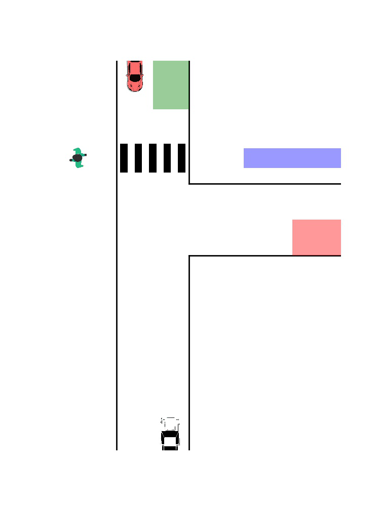

Main repository of **Back to the Future: Efficient, Time-Consistent Solutions in Reach-Avoid Games** accepted to ICRA 2022. (https://arxiv.org/pdf/2109.07673.pdf)

Code is tested on M1 Mac and Ubuntu 20.04 using Conda environment (4.10.3). Check ```requirements.txt``` for required packages.

The following runs are fully supported:
* One player case, single goal with multiple obstacles in free space (pinch-point and time consistent).
* Three players case, t-intersection environment (pinch-point and time consistent).

The following runs are currently being reviewed:
* Two players case, t-intersection environment (pinch-point and time consistent, cooperative and adversarial).

Check back and fetch the latest update before running.

# How to run
Run ```run.py``` directly with flags to change the env configs
```
python3 run.py [flags]
```
Example:
```
python3 run.py --no_players 1 --env_type goal_with_obs --init_states 6.0 0.0 1.563 0.0 8.0
```
Or run our samples listed in *./example*:
```
python3 example/<name of example>
```
For example:
```
python3 example/one_player_time_consistent.py
```

Evaluate GIF file can be created using ```evaluate.py```
```
python3 evaluate.py --loadpath result/experiment_2022-02-20-11_58_33/ --evaluate rollout
```
You can specify which iteration you want to create GIF image by adding in ```--iteration <iteration>``` to the command.

```evaluate.py``` supports three different runs:
* Evaluate the training process (for all cases), ```--evaluate train```
* Evaluate the rollout (for three-player case), ```--evaluate rollout```
* Evaluate the concave hull of all the trajectories created during the training process (for three-player case) ```--evaluate spectrum```

## Run evaluate for train process
When run evaluate for train process, all images generated throughout the run will be merged to a GIF file showing the training process. The following GIF is a sample output from this process. The flag ```--loadpath``` has to be an experiment directory with ```figures``` folder.
```
python3 evaluate.py --loadpath result/experiment_2022-02-19-20_48_36 --evaluate train
```
Output:


**Note**: This works for all run cases, provided that all figures of training process is stored in folder structure ```result/<experiment>/figures/```.

## Run evalute rollout of chosen iteration
When you want to deploy your trajectory, you can use ```--evaluate rollout```. It will get the trajectory of the chosen iteration via ```--iteration <number>``` or the last iteration if flag is not passed, and generate a GIF showing the deployment of players following the chosen trajectories:
```
python3 evaluate.py --loadpath result/experiment_2022-02-21-20_51_25 --evaluate rollout
```
Output:



**Note**: This only works for three-player case as of now.

## Run evaluate the range of trajectories while training
A concave hull will be created to bound all the generated trajectories throughout training to give you a visualization of the set of trajectories. Pass ```--evaluate spectrum``` to the command to run this function
```
python3 evaluate.py --loadpath result/experiment_2022-02-21-21_46_25 --evaluate spectrum --iteration 84
```
You can also specify which iteration to plot on top of the concave hull by passing ```--iteration <number>```. If no iteration flag is passed, last iteration will be used.
Output:


**Note**: This only works for three-player case as of now.

# Batch run
There is a ```run_batch.py``` file to help automatically generate randomized initialization data for multiple runs for one-player case. Change the initialization range in the script before running to match your targeted test cases. You can either choose to run only **time_consistent**, **time_inconsistent** or **both**. If **both** is chosen, the test cases across time consistetn and inconsistent will be the same. Each experiment in the batch will have its own log file and figures, there will also be a common batch log to record all commands used to run the experiments in the batch.
**Note**: If you do not want to either have logs or plots, or methods of running for the batch run, change information in the **base_flag** in the script.
```
base_flag = "   python3 run.py                      \
                --no_players 1                      \
                --env_type goal_with_obs            \
                --eps_control 0.1 --eps_state 0.1   \
                --linesearch                        \
                --alpha_scaling trust_region        \
                --batch_run                         \
                --plot                              \
                --log                               \
                --hallucinated                      \
            "
```

Once finish running, you can analyze the data in the batch by either running ```analyze.ipynb```. Each batch can be imported as a ```Batch``` object with certain functions. You can also quickly check on the convergence rate of the batch run and see the resulting plots by running ```evaluate_batch.py```.
```
python3 evaluate_batch.py --loadpath result/batch-2022-02-19/ --exp_suffix exp_time_consistent
```